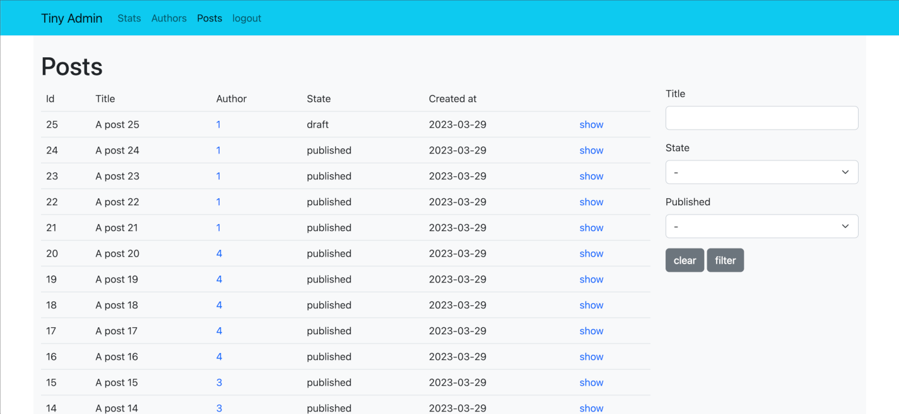

# Tiny Admin

A compact and composible dashboard component for Ruby.

The main features are:
- a Rack app that can be mounted in any Rack-enabled framework;
- some features are handled as plugins, so they can be replaced with little effort;
- routing is provided by Roda (which is small and performant);
- views are Phlex components.

See [extra](extra) folder for usage examples.

Please ⭐ if you like it.



## Install

- Add to your Gemfile: `gem 'tiny_admin'`
- For a Rails project: add an initializer and the YAML config - see [configuration](#configuration) below.

## Plugins and components

Every plugin or component can be replaced.

### Authentication

There are 2 plugins included:
- _SimpleAuth_: provides a simple session authentication based on Warden (`warden` gem must be included in the host project);
- _NoAuth_: no authentication.

### Repository

There is 1 plugin included:
- _ActiveRecordRepository_: isolates the query layer to expose the resources in the admin interface.

### View pages

There are 5 view pages included:
- _Root_: define how to present the content in the main page of the interface;
- _PageNotFound_: define how to present pages not found;
- _RecordNotFound_: define how to present record not found page;
- _SimpleAuthLogin_: define how to present the login form for SimpleAuth plugin;
- _Index_: define how to present a collection of items;
- _Show_: define how to present the details of an item.

### View components

There are 5 view components included:
- _FiltersForm_: define how to present the filters form in the resource collection pages;
- _Flash_: define how to present the flash messages;
- _Head_: define how to present the Head tag;
- _Navbar_: define how to present the navbar (the default one uses the Bootstrap structure);
- _Pagination_: define how to present the pagination of a collection.

## Configuration

TinyAdmin can be configured programmatically or using a YAML config.

Example:

```rb
# config/initializers/tiny_admin.rb

# hash generated using: Digest::SHA512.hexdigest("changeme")
ENV['ADMIN_PASSWORD_HASH'] = 'f1891cea80fc05e433c943254c6bdabc159577a02a7395dfebbfbc4f7661d4af56f2d372131a45936de40160007368a56ef216a30cb202c66d3145fd24380906'
config = Rails.root.join('config/tiny_admin.yml').to_s
TinyAdmin.configure_from_file(config)
```

```yml
---
authentication:
  plugin: TinyAdmin::Plugins::SimpleAuth
page_not_found: Admin::PageNotFound
record_not_found: Admin::RecordNotFound
root:
  title: 'Tiny Admin'
  page: Admin::PageRoot
  # redirect: posts
sections:
  - slug: google
    name: Google.it
    type: url
    url: https://www.google.it
    options:
      target: '_blank'
  - slug: stats
    name: Stats
    type: page
    page: Admin::Stats
  - slug: authors
    name: Authors
    type: resource
    model: Author
    repository: Admin::AuthorsRepo
    collection_actions:
      - latests: Admin::LatestAuthorsAction
    member_actions:
      - csv_export: Admin::CsvExportAuthorAction
    # only:
    #   - index
    # options:
    #   - hidden
  - slug: posts
    name: Posts
    type: resource
    model: Post
    index:
      sort:
        - author_id DESC
      pagination: 15
      attributes:
        - id
        - title
        - field: author_id
          link_to: authors
        - state
        - published
        - dt
        - field: created_at
          converter: Admin::Utils
          method: datetime_formatter
      filters:
        - title
        - field: state
          type: select
          values:
            - available
            - unavailable
            - arriving
        - published
    show:
      attributes:
        - id
        - title
        - description
        - field: author_id
          link_to: authors
        - category
        - published
        - state
        - created_at
style_links:
  - href: /bootstrap.min.css
    rel: stylesheet
scripts:
  - src: /bootstrap.bundle.min.js
extra_styles: >
  .navbar {
    background-color: var(--bs-cyan);
  }
  .main-content {
    background-color: var(--bs-gray-100);
  }
  .main-content a {
    text-decoration: none;
  }
```

## Do you like it? Star it!

If you use this component just star it. A developer is more motivated to improve a project when there is some interest.

Or consider offering me a coffee, it's a small thing but it is greatly appreciated: [about me](https://www.blocknot.es/about-me).

## Contributors

- [Mattia Roccoberton](https://blocknot.es/): author

## License

The gem is available as open source under the terms of the [MIT License](https://opensource.org/licenses/MIT).
